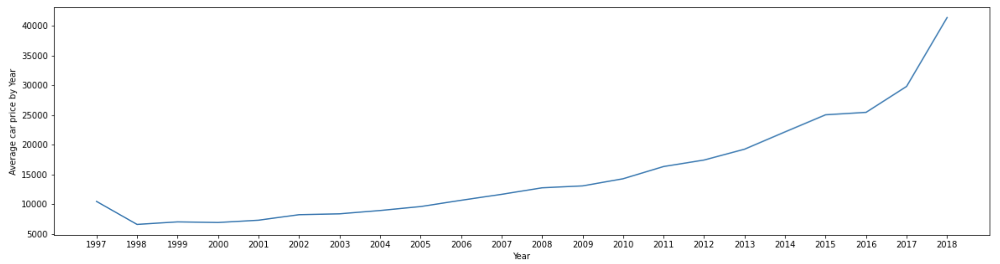
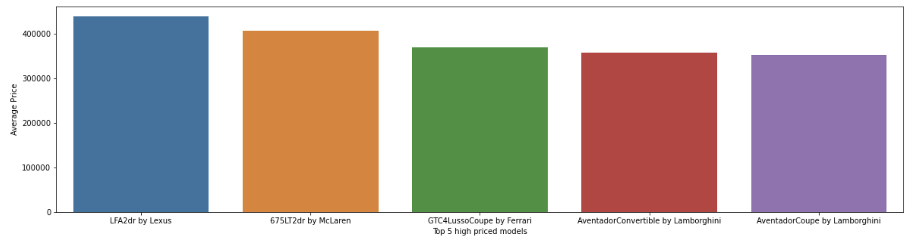
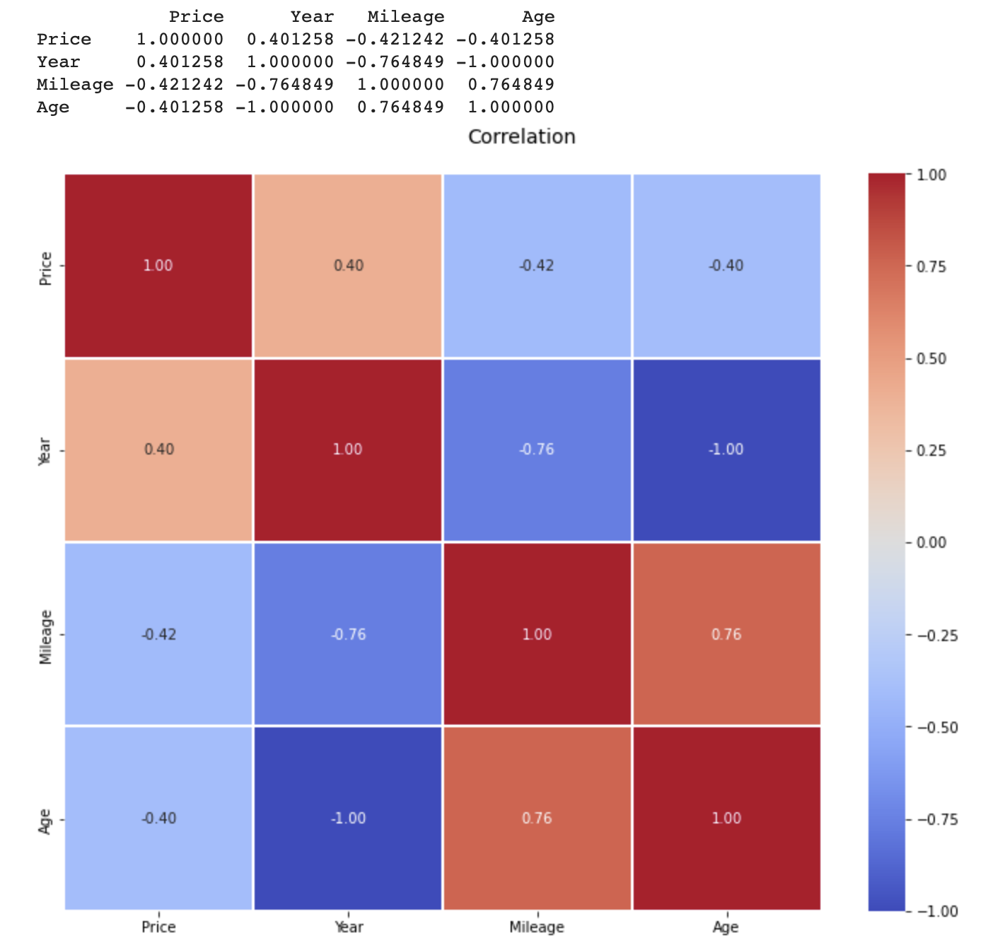
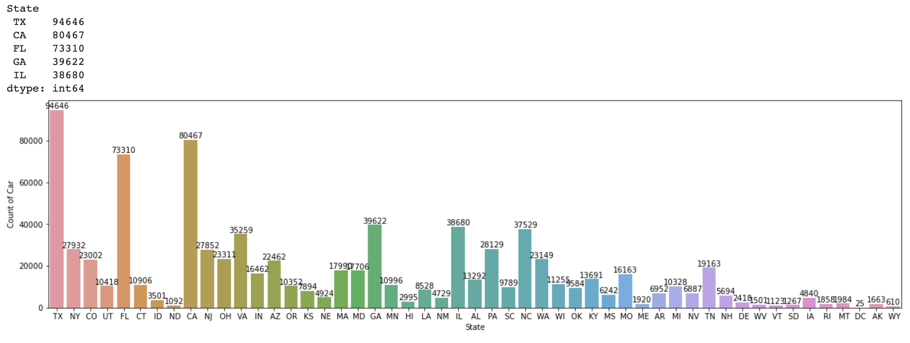
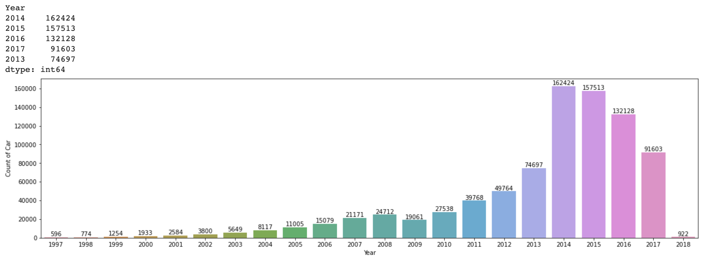

# Used Car Price Prediction
The COVID-19 pandemic started in March 2020 and has changed many aspects of the world, and the used motor vehicle market has suffered a direct impact. A shortage of components causes a decrease in new car production due to a disrupted supply chain, therefore the value of the used car has skyrocketed since the pandemic. In this project, I will create a machine learning model that will predict used car prices using it's information.
## 1.Data
The chosen dataset is obtained from Kaggle, it includes datas for the cars price, year, mileage, city, state, vin, make, and model. To view the original Kaggle website, click on the link below
- [Kaggle Dataset](https://www.kaggle.com/datasets/harikrishnareddyb/used-car-price-predictions?select=true_car_listings.csv)
## 2.Data Wrangling
[Data Wrangling Report](https://github.com/MarquinhosWang/SBDS/blob/565d778b993679510681dd0977bae1d50eb3360b/Capstone%202/Cap2_data_wrangling.ipynb)
- The dataset does not have any missing value that could cause problems to our machine learning algorithms 
- The dataset contains many duplicated values that could cause our model to overfit, these duplicated values are droped
- After dropping duplicated values our dataset has 852092 rows.
## 3.EDA
[EDA Report](https://github.com/MarquinhosWang/SBDS/blob/10b25d9b17be079757f7180928436aac31be9716/Capstone%202/Cap2_EDA.ipynb)
 
Below are the 5 questions that I explored in the EDA process
- Average used car price per year

- Top 5 most expensive used car models

- What features correlate the most with the price

- Which state sold most used cars

- Which year has most sold used cars.

## 4.Pre-processing and Training Data Development
[Pre-processing and Training Data Development](https://github.com/MarquinhosWang/SBDS/blob/0f6568b332dc21aad8eedb332f937653a6382370/Capstone%202/CAP2_preprocessing.ipynb)
- Dropping Vin column, it is only a car id, will not be needed in the machine learning.
- There are 4 features that are categorical, since each feature has a very large amount of values,they are transformed into numerical using LabelEncoder.
- The dataset is split into training and testing subsets, where x is the price feature and y is the rest. The data set is splitted 80/20 where 20% is the testing data.
- Sicne the numeric features of the dataset are in different ranges and this project's machine learning algorithm use Euclidean distance, these features need to be scaled.
- Standardization will be the method used for scalling, it makes the values of each feature in the data have zero mean and unit variance.
## 5.Modeling
[Modeling](https://github.com/MarquinhosWang/SBDS/blob/0f6568b332dc21aad8eedb332f937653a6382370/Capstone%202/CAP2_modeling.ipynb)
 
In this project three machine learning algorithm are tested, there are:
1. Linear Regression
2. Random Forrest Regressor
3. Adaptive Boosting Regressor
** Best algorithm: Random Forest Regressor**
The Random Forest Regressor takes various different regression decision tree, each tree predicts the expected used car price based on it's decision criteria, then random forest regression calculates the average of all individual prediction to generate the best estimate for the car price.
In this test, the R^2 for Random Forest Regressor is 0.9662798070787618

